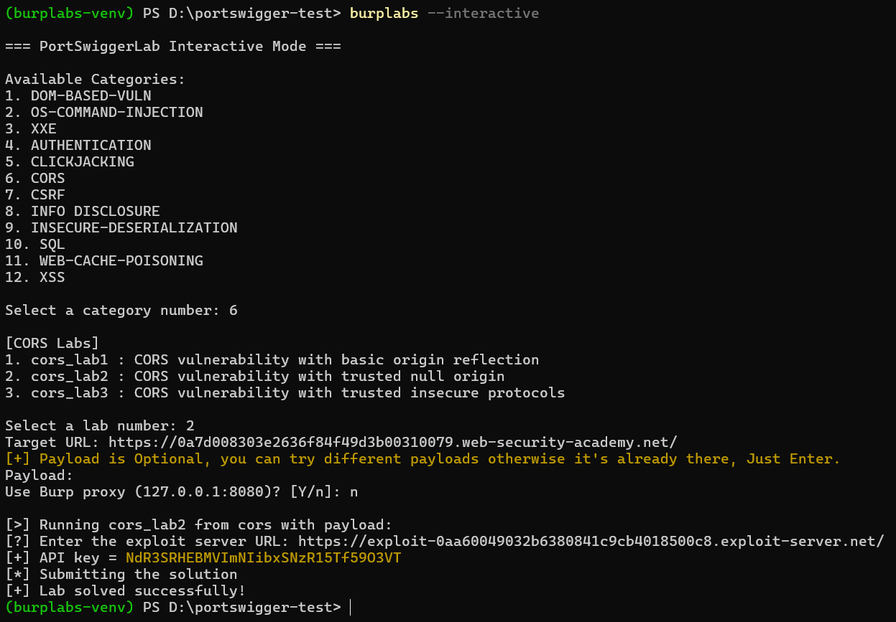

# Burplabs

**burplabs** is a modular, Python-based CLI tool that automates solving labs from [PortSwigger Web Security Academy](https://portswigger.net/web-security).  
Its like like `netexec`, but made for web apps.

---

It currently has **113/269** labs and I am adding rest of the labs daily.

I know this not something new but this helped me to get better with Python Scripting and I adjusted many other things. I recommend to try this when you know how lab is solved and just want to solve it. Please do not use this before understanding the concepts.

## Features

- CLI interface
- Modular architecture – each lab is a standalone Python file
- Custom Proxy and No Proxy also support (`--proxy`, `--no-proxy`)
- Docker-compatible
- Easily extensible - add your own code if you want!

---

## Installation

### Option 1: Install via pip (recommended)

Windows

```powershell
python -m venv burplabs-venv
.\burplabs-venv\scripts\Activate.ps1
pip install burplabs
```

### Option 2: Git clone

```bash
git clone https://github.com/spbavarva/portswigger-labs-scripts.git
cd portswiggerlab
pip install .
```

(Docker will be added soon)

---

## Usage

### View Help

```bash
burplabs -h
```

### List All Available Labs

```bash
burplabs --list-labs
```

### Interactive Mode

```bash
burplabs --interactive
```
and then just follow the steps. You can even enter custom proxy when it prompts or if you want to use burp proxy then just open burp and hit 'Y' when it prompts for default proxy to get requests on your burp.

Or you can hit 'n' when it prompts and you don't need to open burp at all.




---

## Adding New Labs

To add a new lab:

1. Create a new file in `burplabs/labs/name-of-the-folder`, e.g. `sql_lab3.py`
2. It must define a `run(url, payload, proxies=None)` function
3. That’s it! The lab will be auto-detected and usable like:

```bash
portswiggerlab sql_lab3 --url ... --payload ...
```

---

## Author

Credit to Rana Khalil for inspiring me for this!

Built by [Sneh](https://github.com/spbavarva)
Portfolio: [snehbavarva.com](https://www.snehbavarva.com)
If you like it, give it a ⭐ on GitHub!

---

## License

MIT License